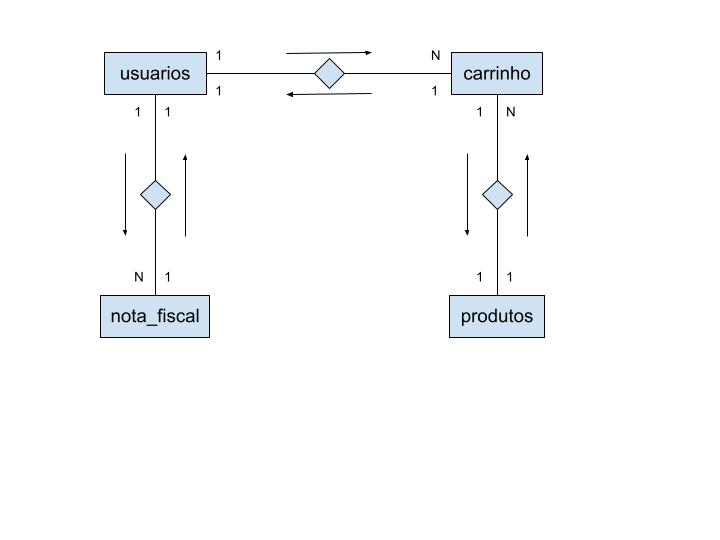
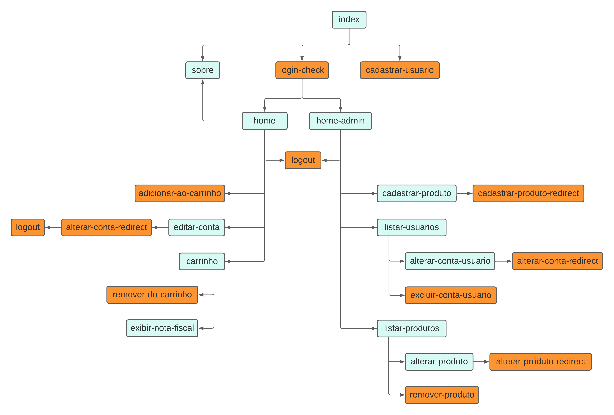

# Projeto Web - TechnoStore

## Objetivo do site

Este projeto foi desenvolvido para um e-commerce de produtos voltados a tecnologia, onde o mesmo terá um usuário admin para cadastrar e gerir os produtos registrados e também a gestão de usuários do site.

## Requisitos do sistema

Ações do sistema: <u>listar</u>, <u>inserir</u>, <u>alterar</u> e <u>excluir</u>, nos Padrões Web (Web Standards) de HTML.

* Cadastro de usuário;
  * Obs: O usuário admin vem pré-definido como o primeiro usuário no script SQL, tendo ele permissões especiais dentro do site, por isso não há a necessidade de definir um usuário "root" dentro do site.
* Consulta e alteração da tabela "carrinho" (a inserção é feita com produtos já existentes, escolhidas por cada usuário; a exclusão de itens da tabela "carrinho" é dependente de cada usuário, sendo o mesmo responsável por fazer a remoção dos produtos vinculados ao seu carrinho);
* Cadastro e consulta de nota fiscal do usuário;
* Alteração de cadastro de usuário;

Obs: os requisitos a seguir só podem ser feitos pelo administrador da página (admin)

* Cadastro de produtos;
* Consulta, alteração e exclusão de cadastro de produtos;
* Consulta, alteração e exclusão de cadastro de usuários;

## Levantamento, detalhamento e organização dos requisitos do sistema

* Dados de usuários (ID, nome, email, senha)
* Dados de produtos (ID, nome, descrição; preço do produto);
* Dados do carrinho (ID, ID do usuário, ID do produto);
* Dados da nota fiscal (ID, ID do usuário, data de emissão da nota fiscal, valor total de compras);

## Modelagem Conceitual

## MER

## Banco de Dados

* nome do banco: technostore

tabela **usuarios**
campo | tipo | tamanho | auto incremento | chave primária
:---: | :---: | :---: | :---: | :---:
id | int | 11 | sim | sim
email | varchar | 100 | não | não
nome | varchar | 150 | não | não
senha | varchar | 50 | não | não

tabela **nota_fiscal**
campo | tipo | tamanho | auto incremento | chave primária | default/expression
:---: | :---: | :---: | :---: | :---: | :---:
id | int | 11 | sim | sim |
data_emissao | datetime | | não | não |
valor_total | decimal | 10,2 | não | não |
usuarios_id | int | 11 | não | sim | on update cascade on delete cascade

tabela **carrinho**
campo | tipo | tamanho | auto incremento | chave primária | default/expression
:---: | :---: | :---: | :---: | :---:| :---:
id | int | 11 | sim | sim
usuarios_id | int | 11 | não | sim | on update cascade on delete cascade
produtos_id | int | 11 | não | sim | on update cascade on delete cascade

tabela **produtos**
campo | tipo | tamanho | auto incremento | chave primária
:---: | :---: | :---: | :---: | :---:
id | int | 11 | sim | sim
nome | varchar | 45 | não | não
descricao | text | | não | não
preco | decimal | 10,2 | não | não

## Mapa do Site

* Os arquivos com a cor azul são páginas visíveis do site, que o usuário pode visualizar e interagir.
* Os arquivos em laranja são páginas de redirecionamento, que contém arquivos php puro e comandos CRUD.

## Como rodar o site em seu Computador?

* Requisitos essenciais:
  * ter o Xampp instalado na máquina (preferencialmente a versão mais recente).
  * SO Windows (pode ser outro sistema operacional, estou indicando o Windows como padrão para facilitar o entendimento e coincidir com os comandos indicados abaixo)
  * baixar o repositório e colocar no seguinte local da sua maquina: `C:\xampp\htdocs`. Caso o repositório venha compactado, basta descompactá-lo no local indicado.

Primeiramente, abra o Xampp em sua máquina. Execute a opção "MySQL" se caso não estiver ativa. Ative também a opção "Apache", esta opção é para ver a página ativa no navegador.

Logo após, execute os seguintes comandos no cmd:

`cd /` → Pressione a tecla ENTER. O comando vai te redirecionar para o diretório raíz da sua máquina.

`cd xampp/mysql/bin` → Pressione a tecla ENTER. O comando faz acesso a pasta bin do MySQL (é necessário para executar os comandos a seguir).

`mysql.exe -h localhost -u root -p` → Pressione a tecla ENTER em seguida. O programa irá solicitar a senha para acessar o MySQL. A senha padrão é vazio ou root.

Ao colocar a senha, o prompt do MySQL é inicializado. A partir daqui já estamos com o servidor de banco de dados MySQL funcionando.

`source C:\xampp\htdocs\ProjetoWeb3A\src\sql\technostore_backup.sql` → Ao cumprir os requisitos essenciais, o caminho padrão estará de acordo com o indicado no comando, caso contrário, basta copiar o local do arquivo SQL em sua máquina, desde que o repositório esteja localizado na pasta htdocs.

Após os comandos executados e os requisitos essenciais efetuados, abra o seu navegador e insira na URL: `localhost/ProjetoWeb3A/`

Pronto :), a página estará funcionando no seu navegador.
